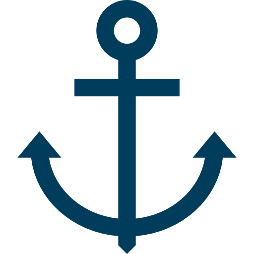

<h1 align="center">🖐️ Senior Software Engineer 🖐️</h1> 
 
🔧 I specialize in designing **robust, scalable, cloud-native systems**. With years of fullstack experience, I'm now focused on **architecting software solutions** that align with business strategy, ensure long-term maintainability, and embrace modern engineering standards.

> “Good software architecture is not just about choosing the right tools — it's about designing systems that evolve gracefully.” 

---

## 💼 Areas of Expertise

- 🧠 **System Design & Architecture Patterns** – Microservices, Event-Driven Architecture, Monolith to Microservices Transition
- ☁️ **Cloud-Native Development** – AWS (EC2, S3, Lambda, ECS, RDS), Azure fundamentals
- 📐 **Domain-Driven Design (DDD)**, Clean Architecture, SOLID Principles
- ⚙️ **DevOps & Infrastructure as Code** – Docker, GitHub Actions, Terraform, CI/CD pipelines
- 📈 **Scalability, Reliability & Observability** – Load balancing, rate limiting, monitoring (Prometheus, Grafana)
- 🔐 **Security Best Practices** – OAuth2, JWT, secure coding principles
- 📊 **Data-Driven Architecture** – Kafka, PostgreSQL, NoSQL, event sourcing
- 👥 **Technical Leadership** – Mentoring, documentation, stakeholder communication, trade-off analysis

---
<!-- <h1 align="center"> Archievements </h1> -->
<!-- 

  

 -->
<table align="center">
<tr>
    <td align="center" width="90">
      
       NFT
    </td>
    <td align="center" width="90">
      
       DeFi
    </td>
    <td align="center" width="90">
      
       Ethereum
    </td>
    <td align="center" width="90">
      
       Solana
    </td>
    <td align="center" width="90">
      
       Solidity
    </td>
    <td align="center" width="90">
      
       Rust
    </td>
    <td align="center" width="90">
      
       Anchor
    </td>
    <td align="center" width="90">
      
       Foundry
    </td>
    <td align="center" width="90">
      
       HardHat
    </td>
    <td align="center" width="90">
      
       Rails
    </td>
  </tr>
  <tr>
    <td align="center" width="90">
      
       React
    </td>
    <td align="center" width="90">
      
       Next.js
    </td>
    <td align="center" width="90">
      
       Vue
    </td>
    <td align="center" width="90">
      
       Nuxt.js
    </td>
    <td align="center" width="90">
      
       Angular
    </td>
    <td align="center" width="90">
      
       Svelte
    </td>
    <td align="center" width="90">
      
       Tailwind
    </td>
    <td align="center" width="90">
        
       GraphQL
    </td>
    <td align="center" width="90">
      
       Three.js
    </td>
    <td align="center" width="90">
      
       Android
    </td>
  </tr>
  <tr>
    <td align="center" width="90">
      
       Ruby
    </td>
    <td align="center" width="90">
      
       GoLang
    </td>
    <td align="center" width="90">
      
       Express
    </td>
    <td align="center" width="90">
      
       Nest.js
    </td>
    <td align="center" width="90">
      
       Django
    </td>
    <td align="center" width="90">
      
       Laravel
    </td>
    <td align="center" width="90">
      
       Flutter
    </td>
    <td align="center" width="90">
      
       MongoDB
    </td>
    <td align="center" width="90">
      
       PostgreSQL
    </td>
    <td align="center" width="90">
      
       Python
    </td>
  </tr>
</table>
 
## 🛠️ Technologies I Use and Design With

### Languages & Frameworks

### Frontend

### Architecture & Infrastructure

### Databases

### DevOps & Monitoring

---

## 🏗️ Software Architecture Principles I Follow

✅ **Clean Architecture**  
✅ **Scalability by Design**  
✅ **Infrastructure as Code (IaC)**  
✅ **Observability First**  
✅ **Security from Day One**  
✅ **Test-Driven and Behavior-Driven Development (TDD/BDD)**  
✅ **API-First Development**  
✅ **Loose Coupling & High Cohesion**

---

## 📊 GitHub Insights

  

---

## ✍️ Upcoming Content
📌 I'm working on:
- ✍️ **System Design Case Studies**  
- 🧱 Sample architecture diagrams with PlantUML / Mermaid  
- 🧪 Testing strategies at scale  
- 📜 Documentation best practices

---

## 🤝 Let's Connect
- 💼 [LinkedIn](https://www.linkedin.com/in/mdshohelrana/)
- 📬 Email: iamshohelrana@gmail.com
- 🌍 Open to speaking, mentoring, and architecture consulting opportunities

---

> _“Architecture is about intent — shaping code and infrastructure to align with a long-term vision.”_

  

  
  
  

<!--  

  

 -->
<!-- 

  

 -->

 
